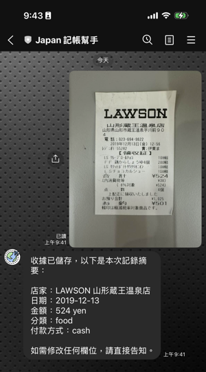
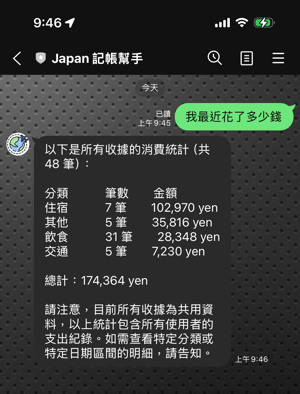
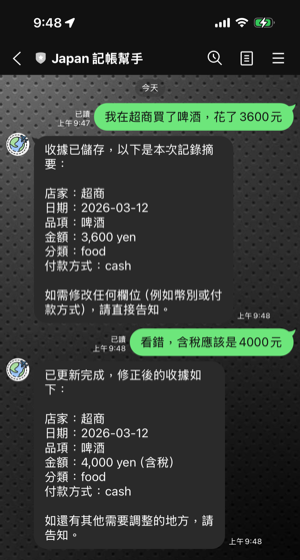
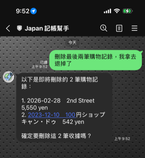
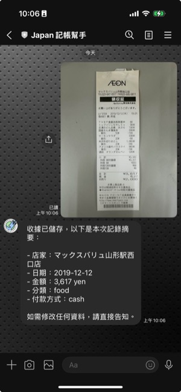
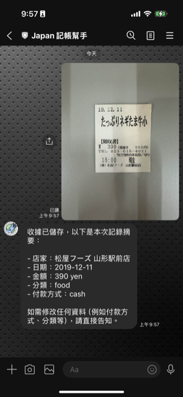
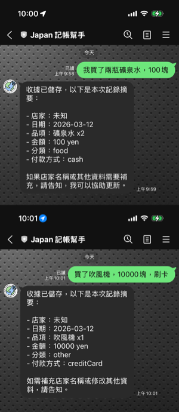

# Agentic AI 實作 — 日本旅行記帳幫手

## 解決痛點

多人旅行，記帳是最煩的環節：

- 收據得逐筆分類、手動輸入試算表
- 紙本容易皺損遺失
- 投幣機消費無收據，只能靠記憶
- 日文苦手看不懂收據欄位，只能瞎猜

## 服務介紹

選擇 LINE 作為介面——跨平台、使用者熟悉的輸入體驗：

- **拍照即記帳** — 收據拍照傳給 Bot，AI 自動辨識店名、品項、金額，不必手動輸入
- **語音 / 文字補記** — 投幣機等沒有收據的消費，直接聽寫或打字描述，當下就建檔
- **日文看得懂** — AI 自動解讀日文欄位，不懂日文也能正確記帳
- **隨口就查帳** — 用日常對話查詢、刪除、管理消費紀錄
- **多人一起記** — 旅伴各自傳收據給 Bot，帳目自動彙整
- **匯出試算表** — 匯出至 Google Sheets，直接用於分帳

---

## Agentic AI 實作重點

### 1. 自主 MCP Tool 選擇（Autonomous Tool Selection）

Agent 使用三種 MCP tool：

| MCP Tool | 用途 |
|----------|------|
| 視覺/語意辨識 | 從收據或文字描述中擷取結構化資料 |
| Supabase 存取 | 消費記錄 CRUD |
| Google Sheets 輸出 | 匯出為試算表 |

使用者傳入訊息後，agent 自行判斷該呼叫哪些 MCP tool、依序處理。例如：

> 傳送一張收據，agent 會先呼叫視覺辨識 tool 擷取收據欄位，再呼叫 Supabase tool 存入資料庫。



### 2. 多步驟推理（Multi-step Reasoning）

每輪對話最多執行 **8 次 MCP tool call**，agent 會自行串接 tool chain 完成任務。例如：

> 使用者：「我最近花了多少錢？」
> → agent 先查詢最近 10 筆收據
> → agent 再查詢收據總筆數
> → 根據結果組合回覆：列出收據 + 加註「共 N 筆」



### 3. 多輪對話記憶（Conversational Memory）

- **對話有效期**：每段對話保留 12 小時
- **接續對話**：Agent 可恢復先前的對話，保有完整上下文
- **佇列處理**：每位使用者的訊息佇列處理，降低負荷

例如先傳一張收據，稍後再問「剛剛那筆是哪家店？」，agent 能正確回答。



### 4. 條件式行為（Conditional Behavior）

多筆刪除時，agent 會先列出受影響紀錄，詢問「確定要刪除這 N 筆收據嗎？」，確認後才執行。



### 5. 視覺/語意辨識 + 結構化輸出（Vision + Structured Output）

- 收據與文字描述的辨識同時支援 **Claude 與 Gemini**
- 辨識結果遵循固定格式（店名、品項、總金額等欄位），保持輸出格式一致





---

## 架構圖

```
+----------+   webhook   +-------------------+
|   LINE   | ----------> |  Receipt Gateway  |
|   User   | <---------- |     (:4000)       |
+----------+   reply     +--------+----------+
                                  |
                           text / image
                                  v
                         +----------------+       +----------+
                         |  Agent (SDK)   | ----> | Supabase |
                         |  Claude        |       |    DB    |
                         +-------+--------+       +----------+
                                 ^
                                 | extract
                                 v
                         +----------------+
                         |  Vision Agent  |
                         | Claude / Gemini|
                         +----------------+
```

---

## Tech Stack

| 層級 | 技術 |
|------|------|
| 通訊介面 | LINE Messaging API |
| AI Agent | Anthropic Agent SDK + Claude / Google Gemini |
| 資料庫 | Supabase |

---

## 改善空間
- **同步等待** — Bot 需完成圖片辨識與資料存入後才回應使用者，體感延遲明顯。
- **查詢回應速度** — 為維持自然語言查詢，agent 將使用者意圖轉為 SQL 執行（非預定義查詢），靈活度高但回應慢。
- **辨識速度** — Claude 視覺辨識收據的速度慢於 Gemini 2.5 Flash Lite。
