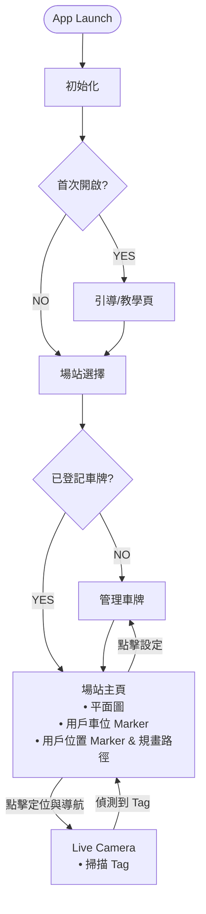

## Flow Diagram

```mermaid
flowchart TD
    Start([App Launch]) --> Init["初始化"]
    Init --> Q1{首次開啟?}
    Q1 -->|YES| Landing["引導/教學頁"]
    Q1 -->|NO| SiteSelect["場站選擇"]
    Landing --> SiteSelect
    SiteSelect --> Q2{已登記車牌?}
    Q2 -->|NO| ManagePlate["管理車牌"]
    Q2 -->|YES| SiteHome["場站主頁<br/>• 平面圖<br/>• 用戶車位 Marker<br/>• 用戶位置 Marker & 規畫路徑"]
    ManagePlate --> SiteHome
    SiteHome -->|點擊設定| ManagePlate
    SiteHome -->|點擊定位與導航| Camera["Live Camera<br/>• 掃描 Tag<br/>"]
    Camera -->|偵測到 Tag| SiteHome
```