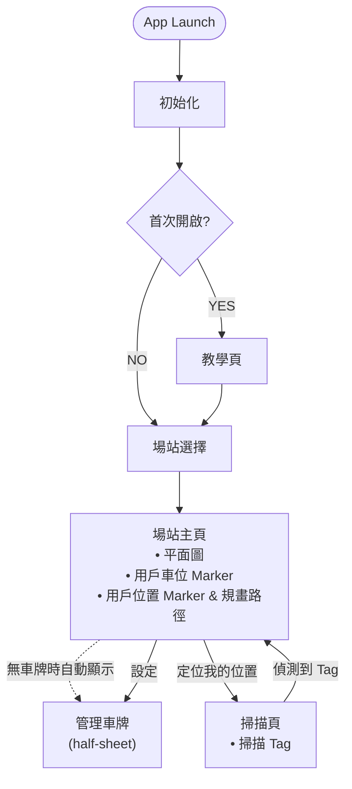

## Flow Diagram

```mermaid
flowchart TD
    Start([App Launch]) --> Init["初始化"]
    Init --> Q1{首次開啟?}
    Q1 -->|YES| Landing["教學頁"]
    Q1 -->|NO| SiteSelect["場站選擇"]
    Landing --> SiteSelect
    SiteSelect --> SiteHome["場站主頁<br/>• 平面圖<br/>• 用戶車位 Marker<br/>• 用戶位置 Marker & 規畫路徑"]
    SiteHome -.->|無車牌時自動顯示| ManagePlate["管理車牌<br/>(half-sheet)"]
    SiteHome -->|設定| ManagePlate    
    SiteHome -->|定位我的位置| Camera["掃描頁<br/>• 掃描 Tag"]
    Camera -->|偵測到 Tag| SiteHome    
```