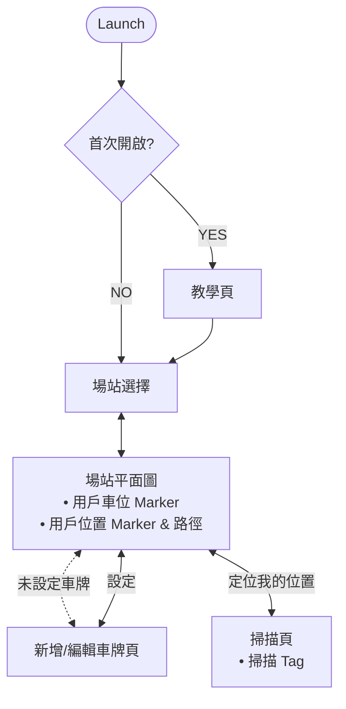

## Flow Diagram

```mermaid
flowchart TD
    Start([Launch]) --> Q1{首次開啟?}
    Q1 -->|YES| Landing["教學頁"]
    Q1 -->|NO| SiteSelect["場站選擇"]
    Landing --> SiteSelect
    SiteSelect <--> SiteHome["場站平面圖<br/>• 用戶車位 Marker<br/>• 用戶位置 Marker & 路徑"]
    SiteHome <-.->|未設定車牌| ManagePlate["新增/編輯車牌頁"]
    SiteHome <-->|設定| ManagePlate    
    SiteHome <-->|定位我的位置| Camera["掃描頁<br/>• 掃描 Tag"]
    
```